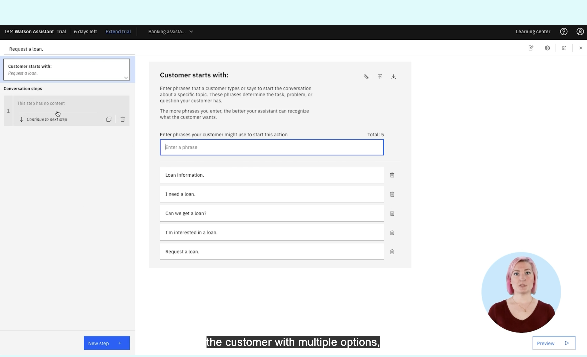
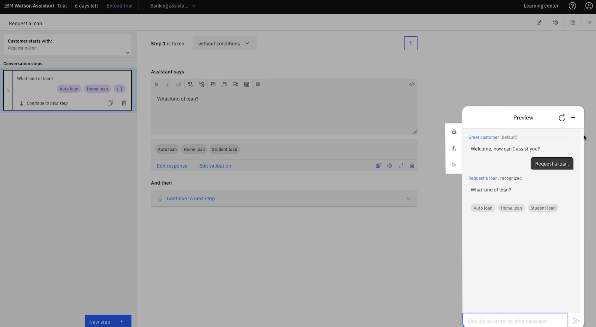
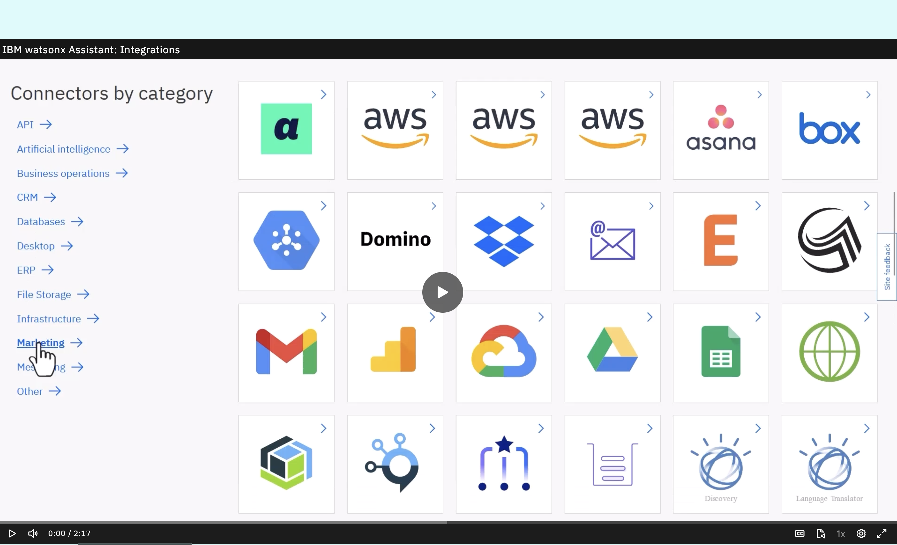
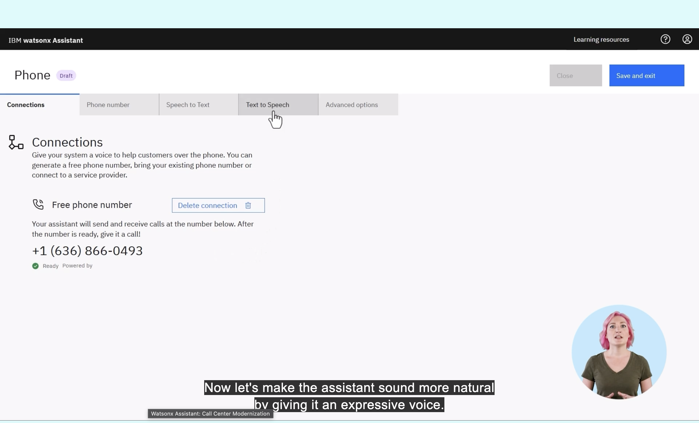
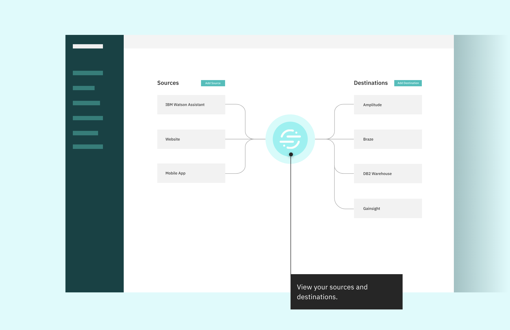
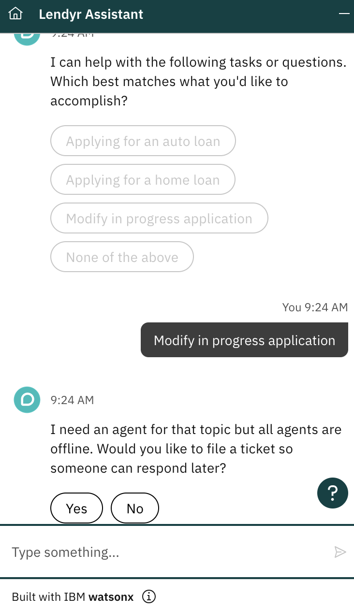
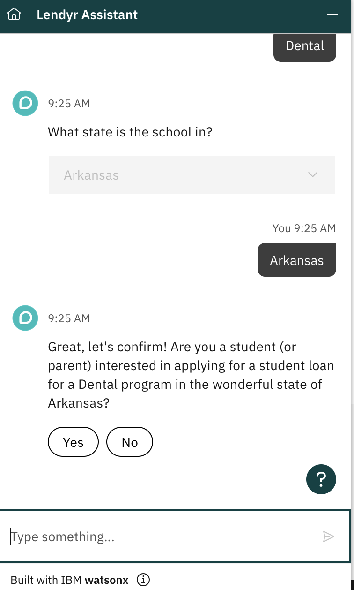
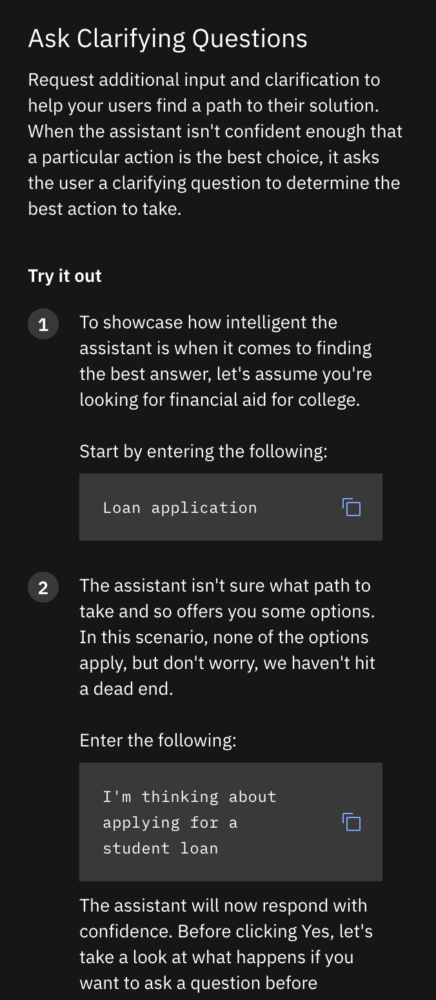
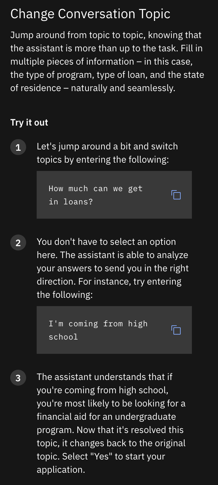
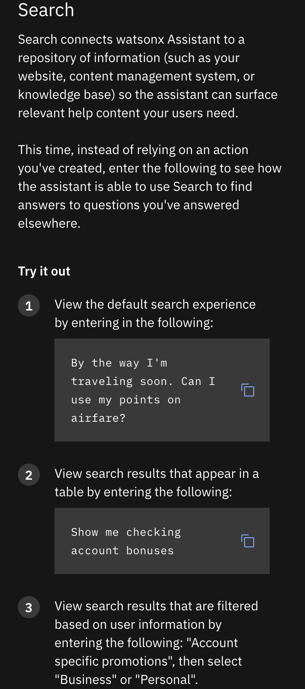

# Lab 10 — Exploration of IBM Watson Assistant: Lendyr Demo

Joseph Clay · TuringCollective · ITAI-1370 · Prof. Anna Devarakonda

---

## 1. Preliminary Research

IBM Watson Assistant is IBM's enterprise conversational-AI platform,
positioned for businesses to build and deploy chatbots that handle
domain-specific tasks — customer service, account questions, loan
applications — rather than functioning as a general-purpose assistant.
Its core building block is the **action**: a defined task (e.g., "Request
a loan") triggered by a set of example phrases, that walks the customer
through a scripted conversation step, collecting information and routing
to the right outcome.

This is a fundamentally different design philosophy from the assistants
already tested in L11 (Siri, Google Assistant) or from a general-purpose
model like ChatGPT. Siri and Google Assistant ship with broad,
pre-trained conversational ability out of the box. Watson Assistant ships
with almost none of that — the business has to build every action, every
trigger phrase, and every response step itself before the assistant can
do anything. It's less a chatbot and more a chatbot *construction kit*.

## 2–3. Accessing and Exploring the Demo

The Lendyr Demo (a banking/loan-services assistant) was explored at
https://www.ibm.com/products/watson-assistant/demos/lendyr/demo.html,
alongside the underlying Watson Assistant trial builder that powers it,
to see both the customer-facing chat and the business-side setup work
required to build it.

### Behind the scenes: building an action

The trial builder ships with a pre-built "Request a loan" action as a
worked example. Trigger phrases ("Loan information," "I need a loan,"
"Can we get a loan?," etc.) are what the assistant matches against to
recognize the customer's intent, and each conversation step has to be
authored manually — including the branching response ("What kind of
loan?" → Auto / Home / Student) shown in the preview panel.

*Figure 1 — The "Request a loan" action's trigger-phrase configuration.*

*Figure 2 — Live preview: the assistant recognizes "Request a loan" and
responds with a branching question (Auto / Home / Student loan).*

The platform also exposes a large enterprise integrations catalog (AWS,
Google Workspace, Salesforce-adjacent tools, Dropbox, Box, phone/voice
connections, and more) — sized for large organizations wiring the
assistant into existing business systems.

*Figure 3 — Watson Assistant's connector catalog, spanning CRM, file
storage, cloud infrastructure, and more.*

*Figure 4 — Phone number + text-to-speech configuration, for deploying
the assistant as a voice-based call-center agent.*

*Figure 5 — Watson Assistant as a data source feeding downstream
analytics/CRM platforms (Amplitude, Braze, DB2 Warehouse, Gainsight).*

### The customer-facing conversation

Interacting with the live Lendyr Assistant surfaced both its scripted
strengths and a real limitation. Selecting **"Modify in progress
application"** from the initial task menu did not lead anywhere useful —
the assistant responded that it needed a human agent for that topic, but
all agents were offline, and offered only to file a support ticket. This
is a concrete example of the chatbot hitting the edge of its scripted
scope: anything outside the paths its designers explicitly built
terminates in a dead end or a handoff, not a real answer.

*Figure 6 — Selecting "Modify in progress application" leads to an
agent-offline message with no other path forward.*

By contrast, staying within the assistant's built script worked well. A
student-loan inquiry for a Dental program in Arkansas was handled
smoothly — the assistant correctly carried the program type and state
across turns and produced an accurate confirmation summary before moving
to the next step.

*Figure 7 — A fully in-scope student-loan flow: the assistant tracks
program type and state correctly across multiple turns.*

IBM's own guided walkthrough also demonstrates the assistant handling
mid-conversation topic changes and connecting to a search index for
questions outside any pre-built action (e.g., "Can I use my points on
airfare?" answered via Search rather than a scripted action).

*Figures 8–10 — IBM's guided tutorial demonstrating clarifying questions,
mid-conversation topic switching, and Search as a fallback for
off-action questions.*

## 4. UI/UX Analysis

**My assessment, in my own words:** This was not intuitive at all,
compared to other chatbots I've used. It's very enterprise-focused and
business-focused — I can see some consumer use cases, but the setup
seemed genuinely complicated. It might have been an innovative approach
at some point, but chatbots today are more intuitive and require far less
setup work. I didn't like that the customer-facing interaction was
mainly narrow inquiries about getting a loan and the different loan types
available. Instead of coming with pre-built skills or tools, it felt like
you had to orchestrate and essentially build that logic and functionality
into the chatbot yourself first — only after that setup work could you
actually query it and get a response with real context behind it. Maybe
that's innovative from a platform-flexibility standpoint, but to me it
felt bulky. It didn't feel fluid, it felt very static, and overall I was
unimpressed.

**Specific observations:**
- **Ease of use:** Low, for anyone without a technical/business-analyst
  background. The trigger-phrase and conversation-step builder is closer
  to light programming than a consumer chat setup.
- **Interface design:** Clean and professionally styled, consistent with
  IBM's enterprise product design language — but that polish is on the
  *builder* tooling, not on making the underlying task easier.
- **Response time:** Fast within its scripted paths; the moment a request
  falls outside a built action (the "Modify in progress application"
  case), the experience collapses to a dead end rather than a graceful
  fallback.
- **Intuitiveness:** Low. Getting anything beyond the demo's pre-built
  paths to work would require real setup effort — a stark contrast to
  general-purpose assistants that respond usefully to almost anything
  out of the box.

## Conclusion

Watson Assistant's real strength and real weakness are the same fact:
it's a construction kit, not a ready-made assistant. That earns it
genuine flexibility for large enterprises with the resources to build and
maintain it — the integrations catalog and voice/phone deployment options
are real enterprise capability. But as a hands-on user experience, it
felt bulky, static, and dated next to consumer assistants that need zero
setup to hold a real conversation. The gap between "impressive
enterprise architecture" and "actually pleasant to use" was the clearest
takeaway from this exploration.

---

**Filename on submission:** `L10_TuringCollective_JosephClay_ITAI1370`
