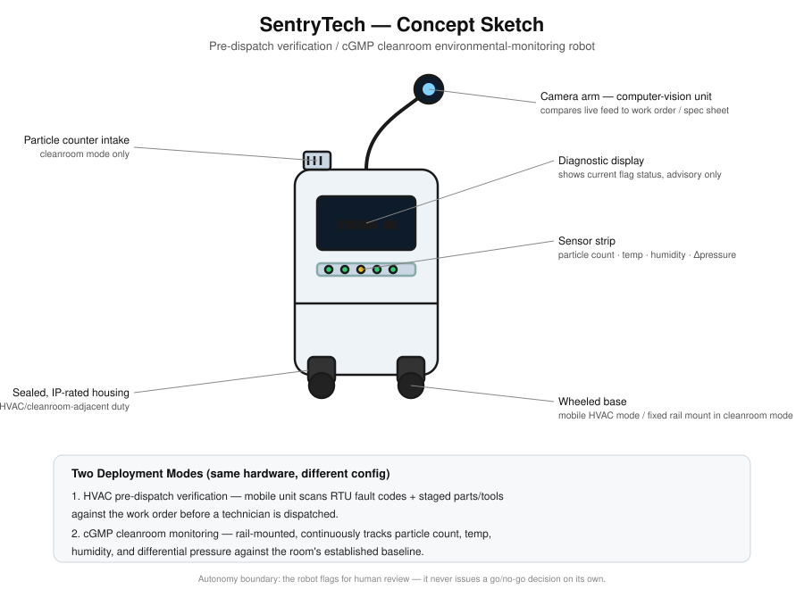

# A13 — Robotic Design and Ethical Analysis Project

Joseph Clay · TuringCollective · ITAI-1370 · Prof. Anna Devarakonda

---

## 1. Application Domain

**Domestic/industrial assistance — commercial HVAC & pharmaceutical cleanroom service.** This domain is chosen because it's real, lived experience — commercial HVAC/refrigeration work (EPA 608 Universal, TDLR #148984) and cGMP biotech cleanroom environments, not a hypothetical.

## 2. Robot Design

**Name:** *SentryTech* — a pre-dispatch verification and cleanroom
environmental-monitoring robot.

**Description:** A wheeled, waist-height service robot that does two jobs
depending on deployment context:

1. **Commercial HVAC pre-dispatch verification** — before a technician is
   dispatched to a job site, SentryTech (or a stationary version mounted
   at the unit) scans the rooftop unit's current state — fault codes,
   visible parts/tools staged nearby, access panel condition — and
   cross-references it against the work order. This directly targets a
   real failure mode: technicians arriving on-site with the wrong
   tools/parts because the work order didn't match actual field
   conditions (the kind of mismatch that causes wasted trips).
2. **cGMP cleanroom environmental monitoring** — in a pharma/biotech
   cleanroom, a stationary/rail-mounted version continuously monitors
   particle counts, temperature, humidity, and differential pressure,
   flagging deviations before they become a batch-compliance incident.

**Physical appearance:** Compact, sealed housing (IP-rated for
cleanroom/HVAC-adjacent environments), a fixed camera arm, and a small
diagnostic display. No manipulator arm — this robot observes and reports,
it does not physically intervene.

## 3. Functionality and AI Integration

- **Computer vision** compares the live camera feed against the work
  order/spec sheet — e.g., confirming a tool or part described in the
  order is actually staged, or that a cleanroom's visible conditions
  (spill, open panel) don't already violate protocol.
- **Fault-code parsing** — reads a unit's digital fault/status codes and
  flags mismatches between reported state and dispatch paperwork.
- **Anomaly detection on sensor time-series** (cleanroom mode) — particle
  count, temp, humidity, pressure readings run through a model trained to
  flag deviations from the room's established baseline, not just fixed
  thresholds — because "normal" varies by room and season.
- **Autonomy boundary:** the robot never makes a go/no-go call on its own.
  It surfaces a flag; a human technician or QA lead makes the actual
  decision. This is a deliberate design constraint, not a limitation to
  apologize for.

**Sensors/inputs:** camera(s), particle counter, temperature/humidity/
differential-pressure sensors, and a read interface for the HVAC unit's
existing fault-code system (no new hardware installed on the unit itself).

## 4. Ethical Analysis

**Privacy:** Camera-based monitoring in a workspace raises the standard
workplace-surveillance question — is this observing the technician, or
the equipment? Mitigation: field of view and recording scope are
contractually and technically restricted to equipment/workspace state,
not worker behavior; footage retention is short and audit-logged.

**Safety:** A false "all clear" from the AI (e.g., missing a real fault
code) could send a technician into a hazardous cleanroom or job site
under wrong assumptions. Mitigation: the system is explicitly advisory —
it flags for human review, and standard PPE/protocol checks remain
mandatory regardless of what the robot reports.

**Job displacement:** This tool doesn't replace a technician's diagnostic
judgment — it replaces the wasted trip, not the trip itself. Worth
naming honestly: pre-dispatch verification could reduce dispatch *volume*
even as it protects the quality of dispatches that do happen; that
tradeoff deserves to be stated, not glossed over.

**Societal impact:** In cGMP contexts specifically, false negatives
(missed deviations) have downstream consequences for drug safety, not
just operational efficiency — the ethical stakes scale with the
industry the robot is deployed into.

**Proposed guidelines:**
- Human sign-off required before any dispatch decision the AI flags.
- Camera footage scoped to equipment/workspace, not worker monitoring.
- Regular audit of false-negative rate in cleanroom mode, given the
  compliance stakes.

## 5. Research Component

This design and ethical analysis draws on the following foundational and
current sources:

- Murphy, R. R. (2000). *Introduction to AI Robotics*. MIT Press. —
  foundational principles behind sensor-driven autonomy and the
  perception-action loop used in SentryTech's design.
- Jobin, A., Ienca, M., & Vayena, E. (2019). The global landscape of AI
  ethics guidelines. *Nature Machine Intelligence, 1*, 389–399. —
  informs the privacy/safety/accountability framework applied in Section 4.
- UNESCO. (2021). *Recommendation on the Ethics of Artificial
  Intelligence*. — grounds the human-sign-off and proportionality
  principles in the proposed guidelines.
- Khan, A. A., Badshah, S., Liang, P., et al. (2022). Ethics of AI: A
  systematic literature review of principles and challenges. In
  *Proceedings of the International Conference on Evaluation and
  Assessment in Software Engineering (EASE)*. arXiv:2109.07906. —
  supports the job-displacement and societal-impact discussion.

## 6. Sketch

*Digitally created concept sketch — labeled diagram showing the camera
arm (computer vision), diagnostic display, sensor strip (particle count,
temperature, humidity, differential pressure), sealed IP-rated housing,
and wheeled base, with both deployment modes (HVAC pre-dispatch /
cGMP cleanroom) noted below.*

---

**Filename on submission:** `A13_TuringCollective_JosephClay_ITAI1370`
